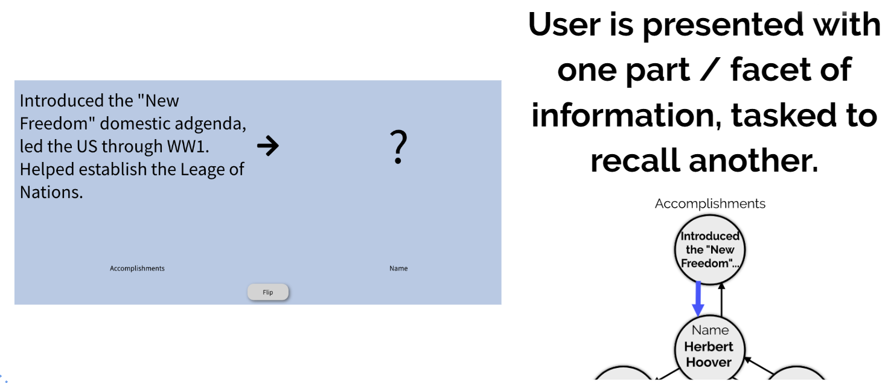
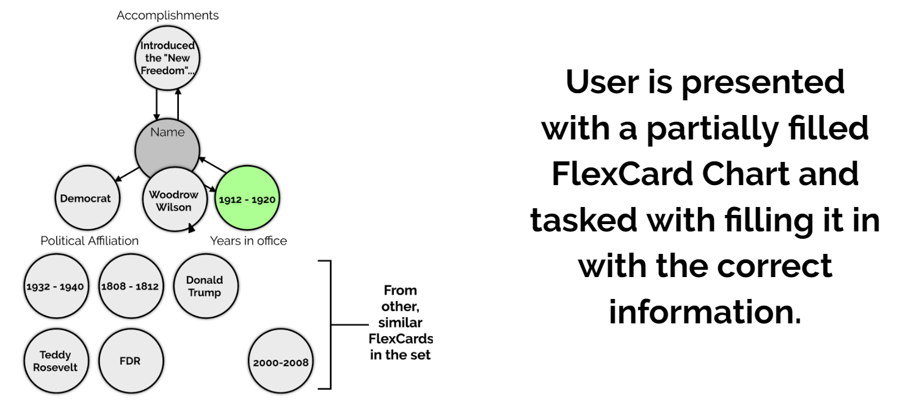
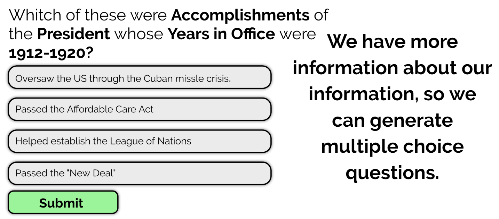

# What is FlexCards?

In short, FlexCards is a new tool for studying anything you can think of. It enables better, deeper understanding of material, and allows users to study information that isn't represented well by traditional methods. Essentially, it's quizlet turned up to 11. 

# How is FlexCards different from existing tools?

## Multi-Aspect Structure
The primary advantage of FlexCards over traditional study tools like flashcards is that it actually breaks down information into separate aspects, and gives the users tools to study these aspects & the way they relate.

This is best illustrated  through an example: 

Say you are a student studying for an AP US History exam, and you want to review all the presidents. You might go on Quizlet and find flashcards looking something like this: 

 
Term on one side, then a ton of information on the other. The two arrows represent the direction in which one can 'derive' the information. So one given the term, one should provide the definition, and given the definition, one can derive the term.

This issue with this is that if you wanted to study the information on the left side specifically, you couldn't. There is no way to study the relationship  between accomplishments and political party. 

And that is where FlexCards comes in.

In FlexCards, instead of a simple two sided representation, break down information into it's specific components. So the card above on Woodrow Wilson would look more like this:

 
Note how there is no link from political affiliation to name. That would be like asking "Who was the democrat president?"

We believe that structuring the information like this enhances understanding, and enables some novel ways to study information: 

#### Aspect-Aspect Recall
At a basic, level, one can study the individual relationships  between aspects.

#### Aspect Matching
 

#### Auto-Generated Multiple Choice
 

## Card Linking
Beyond having muti-faceted information, FlexCards will also allow users to create and study relational information between cards. For example, one could encode & study the fact that **Woodrow Wilson** *attended* **The Treaty of Paris**

## Card Archetypes
One issue that pervades may study platforms is that there is a lot of duplicate information and different cards / sets representing the same thing. 

Flexcards gets around this using **Card Archetypes**, which are a single source of information on a particular topic, that people can add to, and "project" down to only the information they want to study. 

For example, there are many, many things known about Woodrow Wilson, but most of them are irrelevant. The archetype would contain user submitted information on all of these things, so I user could record Woodrow Wilson's birthday, but when one chooses to study this card, they can choose not to study that aspect. 

Furthermore, on any aspect of particular aspect of a FlexCard archetype, people can add specific realizations. So for Woodrow Wilson's "Best Friend" aspect, there might me many realizations / people that users have said are his best friend, but you can choose which best friend you want to treat as the truth, and study. 

This is generally analogous to different textbooks having different definitions for the same term, and you get to choose which definition you want to study. 