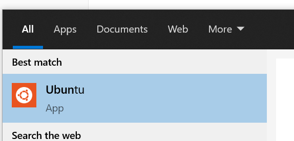
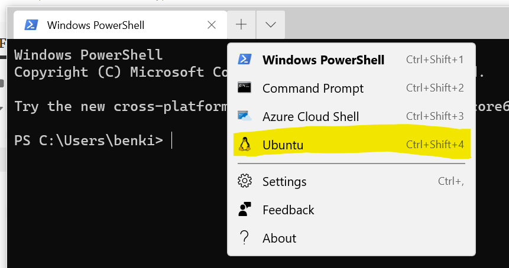

# Development Process

## Project Structure:
All code & data for this project will be housed in our [github team repo.](https://github.com/madison-housing-cs638) There are 4 repositories:

### data
This is where we will store all the datasets that we will use for this project.

### code
This is where we will store all python code needed to generate visualizations, models, and filter data. This will contain a few different kinds of files:

* **`data_retreiver.py`**: This is a file that will be for downloading / transforming data from the data repository into any scripts / notebooks.
* **Common / Utility `.py` files.** We are going to need some scripts for tranforming data, creating models, that kind of thing.
* **Jupyter Notebooks for creating visualizations** These are the notebooks that will actually create the visualizations we showcase. Try to keep these reletively clean. If you have to write a ton of transformational code to help generate a visualization, consider putting that in a common `.py` file.
* **1 Scratch Jupyter Notebook for each teammate** Of course, sometimes you've just gotta try stuff out and be messy, so everyone has one jupyter notebook to playaround in.


### showcase-code
This is all the markdown for the website you are on right now. To chage the website: 
1. Clone the repo, and make the nessessary changes. Refer to the existing code on how to make changes.
2. Once satisfied, make a commit, and push the code.
3. Run `sh deploy.sh` to push the changes to the live site.

### madison-housing-cs638.github.io
This is the generated html for this website. **Do not directly change this.**

## Getting Started.
**WINDOWS 10 STEPS**
### Install The Windows Subsystem for Linux

To ensure consistency, we should all be developing from a shared environment, using similar tools. One of which is The Windows Subsystem for Linux, or WSL (Were going to use WSL2). It is essentialy a high-performance linux emulator that runs on windows. To set this up:

0. Make sure your computer is up to date
1. Install WSL1, by following along with [this](https://pureinfotech.com/install-windows-subsystem-linux-2-windows-10/) tutorial, through **Enabling ‘Virtual Machine Platform’** 
2. Install Ubuntu 

   1. Download it through the Microsoft store [here](https://www.microsoft.com/en-us/p/ubuntu/9nblggh4msv6#activetab=pivot:overviewtab) 

   2. Run Ubuntu, and set yourself up with a username and password.

       

3. Finish Installing WSL 2 and upgrading ubuntu to use WSL 2 be following the rest of [this](https://pureinfotech.com/install-windows-subsystem-linux-2-windows-10/) tutorial, starting with **Enabling Windows Subsystem for Linux 2** 

### Install and Configure Windows Terminal

1. Download Windows Terminal from the Microsoft store [here](https://www.microsoft.com/en-us/p/windows-terminal/9n0dx20hk701#activetab=pivot:overviewtab).

2. Connect to your WSL instance by opening a new tab for ubuntu.

    

3. *(optional)* Make your bash prompt better.

   1. run `code ~/.bashrc` to open up your bash profile.
   2. add `export PS1="\u@\W $ "` at the end of the file, save, then restart the terminal.

**EVERYONE STEPS**

### Install and Configure Git

0. Signup for Github

1. From ubuntu, run `sudo apt install git` & `git --version` to verify the installation.

2. Cache your remote login credentials to avoid typing your username/password on every remote push:

   ```bash
   git config --global user.name "Ben Kizaric"
   git config --global user.email ""
   git config --global credential.helper cache --timeout=3600
   ```

### Install and Configure node and npm
You need this to generate the showcase website.

0. Navigate to your user directory with `cd ~`

1. update / install needed software.

   1. `sudo apt-get update -y` Update existing software
   2. `apt-get install build-essential libssl-dev -y` Install essential software, like a c++ compiler.

2. install node version manager, nvm. You may have to restart your shell.

   `curl -o- https://raw.githubusercontent.com/nvm-sh/nvm/v0.35.3/install.sh | bash` 

3. Install node and npm with `nvm install node` 

### Install Python (Ubuntu / WSL)
1. Run these commands to get needed software
  ```
  sudo apt update
  sudo apt install software-properties-common
  sudo add-apt-repository ppa:deadsnakes/ppa
  # This will prompt you to press enter
  sudo apt update
  ```
2. Install python 3.8 with `sudo apt install python3.8`
