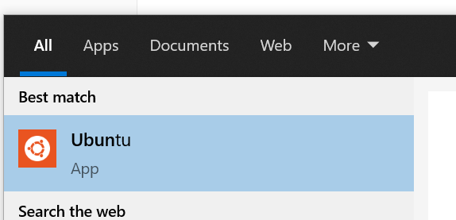

# Setup For Windows 10.

### Install the Windows Subsystem for Linux 2 (WSL 2)

0. Assuming this is being run on the pre-2004 update of windows, you will need to join the windows insider program to get access to WSL 2.

   1. Make sure your PC is up to date.
   2. Go here in settings, and enable windows insider program. Choose the **Slow** track.

    

   3. Update your computer again.

1. Install WSL1, by following along with [this](https://pureinfotech.com/install-windows-subsystem-linux-2-windows-10/) tutorial, through **Enabling ‘Virtual Machine Platform’** 

2. Install Ubuntu 

   1. Download it through the Microsoft store [here](https://www.microsoft.com/en-us/p/ubuntu/9nblggh4msv6#activetab=pivot:overviewtab) 

   2. Run Ubuntu, and set yourself up with a username and password.

       

3. Finish Installing WSL 2 and upgrading ubuntu to use WSL 2 be following the rest of [this](https://pureinfotech.com/install-windows-subsystem-linux-2-windows-10/) tutorial, starting with **Enabling Windows Subsystem for Linux 2** 

### Install and Configure Visual Studio Code

1. Download VS Code [here](https://code.visualstudio.com/).
2. Install the following extensions:
   * [Remote Development Pack](https://marketplace.visualstudio.com/items?itemName=ms-vscode-remote.vscode-remote-extensionpack)
   * [Vetur](https://marketplace.visualstudio.com/items?itemName=octref.vetur) 

### Install and Configure Windows Terminal

1. Download Windows Terminal from the Microsoft store [here](https://www.microsoft.com/en-us/p/windows-terminal/9n0dx20hk701#activetab=pivot:overviewtab).

2. Connect to your WSL instance by opening a new tab for ubuntu.

    

3. *(optional)* Make your bash prompt better.

   1. run `code ~/.bashrc` to open up your bash profile.
   2. add `export PS1="\u@\W $ "` at the end of the file, save, then restart the terminal.

### Install and Configure Git

0. Signup for Github

1. From ubuntu, run `sudo apt install git` & `git --version` to verify the installation.

2. Cache your remote login credentials to avoid typing your username/password on every remote push:

   ```bash
   git config --global user.name "Ben Kizaric"
   git config --global user.email ""
   git config --global credential.helper cache --timeout=3600
   ```

### Install and Configure node and npm

0. Navigate to your user directory with `cd ~`

1. update / install needed software.

   1. `sudo apt-get update -y` Update existing software
   2. `apt-get install build-essential libssl-dev -y` Install essential software, like a c++ compiler.

2. install node version manager, nvm. You may have to restart your shell.

   `curl -o- https://raw.githubusercontent.com/nvm-sh/nvm/v0.35.3/install.sh | bash` 

3. Install node and npm with `nvm install node` 

### Install vue-cli

1. Navigate to your user directory with `cd ~`

2. Install vue-cli `npm install vue-cli -g` 
