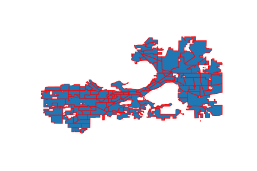
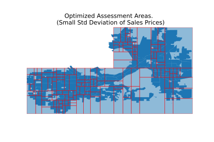

# Assessment Area Alternatives

## Background:
**Assessment Areas** are geographic portions of cities that are meant to group similar homes together. When individual homes are assessed by the city, they are compared against similar homes throughout a city, but mostly against those in the same assessment area. One would expect a home on a city's outskirts to be compared to other more rural homes, not one nestled in the city center. Assessment areas are important because they help determine how much property tax each home has to pay, a significant expense for homeowners, and because those property taxes are the largest source of revenue for cites. 

In this project, we have evaluated the quality of assessment areas 3 ways.

*  Standard Deviation of sales prices of homes within assessment areas. 
    * Motivation: in "good" assessment areas, homes are priced similarly. Assessment areas with a low standard deviation of sales prices will be priced similarly.
* Standard Deviation of growth rate of sales prices of homes within assessment areas.
    * Motivation: in "good" assessment areas, homes are affected by market prices in a similar way, and the values of homes should be growing / shrinking at a similar rate.  
* Assessment Value Accuracy: The percentage of the most recent sales price that the assessed value for a home is above or below the sales price, which can be expressed as `100 * (AssmtPrice-SalesPrice)/SalesPrice`. The average or median of this value for each home in an assessment area is then taken.
    * For example, if a home recently sold for $100K, and it was assessed for \$200K, it's assessment value accuracy score would be 100%, because it is assessed at double it's most recent sales price.
    * Motivation: "Fair" assessment prices for homes should be roughly equal to the sales price of the home, so "fair" assessment areas will have assessment value accuracy scores around zero, or at least all be at the same level of over / under evaluation.

**A note on fairness:** The over/under assessment of a home has different implications for the homeowner and the city. For example, consider when a home was under-assessed (a negative assessment value accuracy score):

* This is *good for the homeowner* because they will be paying less taxes than they would if their home was assessed at the last sales price.  
* But, this is *bad for the city*, because the city will be getting less tax revenue.   

Generally, we consider any score closer to 0 "better", in a way looking at the absolute value of homes, so a home under / overvalued by 10% is equally "accurate". But when we discuss the fairness of assessment values, we are especially sensitive to some sections of the city having a higher/lower scores than others. For example, if we found that predominantly black assessment areas had a higher accuracy score than white neighborhoods, this would hint at a racial unfairness, as black households would be paying more in taxes relative to the sales price of their homes. 

## Alternative Area Maps:

In this context, we only examine single-family assessment areas. There are other areas for multi family / apartment buildings, as well as commercial properties. 

This section examines three potential single families assessment area maps.

* The current assessment area map created by the city of Madison.
* A map created to made the standard deviation of sales prices similar between areas.
* A map created to make the standard deviation of growth rate of sales prices similar between areas.

The last two maps were created by repeatedly splitting a large assessment area (starting with the whole city as 1 assessment area), into two assessment areas, so that the standard deviation of sales price growth rates was a close as possible between the two new, smaller assessment areas. This splitting process is then repeated for each of these two new areas.

To ensure, "normal" looking assessment areas, we imposed a few extra criteria on each split:

- Both assessment areas have to have at least 25 homes in them.
- Both assessment areas have to exceed a minimum size.
- Both assessment areas can't be too wide / narrow, defined by the ratio of their widths and heights.
- The number of homes in the two assessment areas can't be different by more than a factor of 2.

The plots below show the distribution of standard deviations of sales price growth rates in both the new and the old assessment areas.

Even though the new assessment areas were optimized to have near-equal standard deviations of sales prices, the new assessments actually performed worse than the old ones. This might be because they only have straight, right-angle boundaries. It could also be that most of the variation of sales price growth is very localized, and sufficiently large assessment areas will have a hard time separating out the localized variation.

## Alternative Area Maps Price Simulation

Finally, we looked to see the impact that these two maps would have on assessment prices, and if the assessment prices simulated under these new maps are more accurate than for existing maps. In order to do this, we created three "simulated" assessment prices **for each house,** using three regression models, each corresponding to a different assessment area map. Each regression model was trained, using every home in Madison, to predict the total assessment value of a home. The three regression models all used the following variables about homes as inputs:

* The home's time-adjusted sales price 
* The home's square footage
* The year the house was built
* The median sales price of home's in that home's assessment area.
  * This was different between the three assessment area maps.

This process yielded three simulated assessment prices for each house. I then looked at the degree of under/over-evaluation, defined by `100*(AssmtPrice-SalesPrice)/SalesPrice` for each of the simulated assessment prices for each house.

Pictured above is a bar plot depicting the average under-evaluation under the three different maps / three simulated assessment values. The different in evaluation is relatively small, but the price-optimized and growth-optimized maps result in more accurate simulated assessment prices.