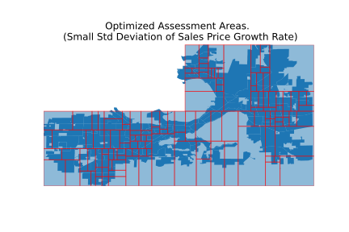
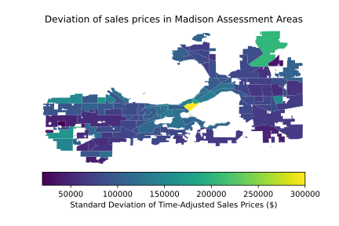
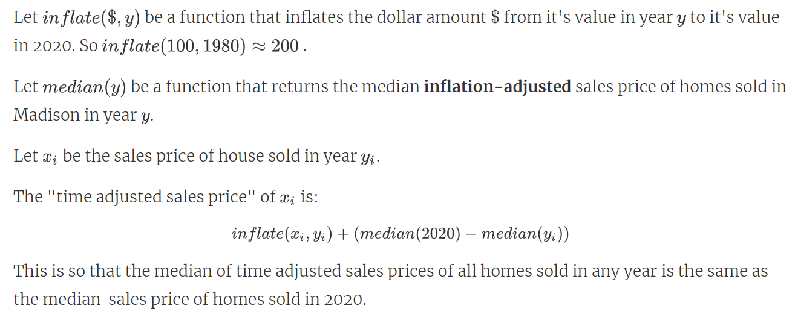
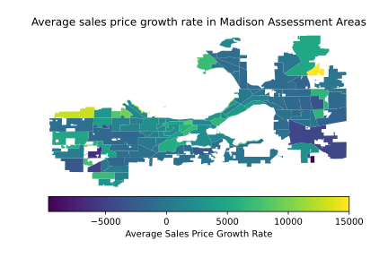
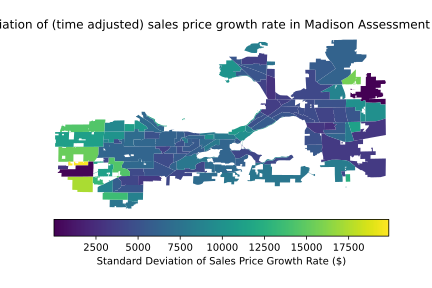

# Assessment Area Evaluation

## Simulated assessment price accuracy.
### Ben Kizaric 11/16

This week, I wanted to see how the alternative assessment area maps we created would impact the actual assessment prices of actual homes. Specifically,  I wanted to see if this made them more or less accurate. To do this, I created three "simulated" assessment prices for each house, using a regression model taking in the time-adjusted sales price for each house, the home's square footage, the year the house was built, and the *median sales price of homes in that home's assessment area.*

This last variable, the median sales price of homes in that home's assessment area, is what I changed to see the effects of the three different assessment area maps.  The three different maps being the actual assessments currently in use by the city, a price-optimized map, and a growth optimized map (See here). 

This process yielded three simulated assessment prices for each house. I then looked at the degree of under/over-evaluation, defined by `100*(AssmtPrice-SalesPrice)/SalesPrice` for each of the simulated assessment prices for each house. 

Pictured above is a bar plot depicting the average under-evaluation under the three different maps / three simulated assessment values. The different in evaluation is relatively small, but the price-optimized and growth-optimized maps result in more accurate simulated assessment prices. 

## Alternative Assessment Area based on Sales Price Growth
### Ben Kizaric 11/09

The map above shows boundaries for new single-family assessment areas. These boundaries were created by repeatedly splitting a large assessment area (starting with the whole city as 1 assessment area), into two assessment areas, so that the standard deviation of sales price growth rates was a close as possible between the two new, smaller assessment areas. This splitting process is then repeated for each of these two new areas.

To ensure, "normal" looking assessment areas, I imposed a few extra criteria on each split:
-  Both assessment areas have to have at least 25 homes in them.
-  Both assessment areas have to exceed a minimum size.
-  Both assessment areas can't be too wide / narrow, defined by the ratio of their widths and heights.
-  The number of homes in the two assessment areas can't be different by more than a factor of 2.

The second plot shows the distribution of standard deviations of sales price growth rates in both the new and the old assessment areas.

Even though the new assessment areas were optimized to have near-equal standard deviations of sales prices, the new assessments actually performed worse than the old ones. This might be because they only have straight, right-angle boundaries. It could also be that most of the variation of sales price growth is very localized, and sufficiently large assessment areas will have a hard time separating out the localized variation.

## Average Sales Price.
### Ben Kizaric 10/26

This heatmap shows the average time-adjusted sales price of homes within each single family assessment area in Madison. 
The small assessment areas bordering the two lakes are the most-expensive areas in Madison. Furthermore, it appears that homes in west Madison sell for less than homes in east Madison. 

## Normaized Deviation of Sales Price.
### Ben Kizaric 11/02

This heatmap shows how much the (Time-Adjusted) sales prices vary within each single family tax assessment area in Madison. The standard deviation is also normalized to account for the fact that assessment areas with generally higher sales prices will also have higher standard deviations of those sales prices.
The time adjustment for sales prices is as follows:
The map shows how most assessment areas have relatively small standard deviations, with the exception of the downtown assessment area downtown, south of the capital. This area will be the topic of further investigation.  

**Time Adjustment Explanation**

**Standard Deviation Normalization**

## Average Sales Price Growth Rate.
### Ben Kizaric 10/26

## Deviation of Sales Price Growth Rate.
### Ben Kizaric 10/26
