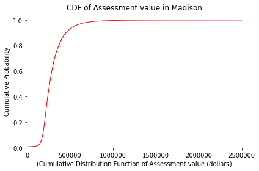

# General Exploration

## Distribution of Single Family Tax-Assessed Home Values
### Desmond Fung, 9/28

In this section, we decided to filter our data based on property use e.g. Condominium, Restaurant, apartment, single-family, and explore into **the total assessment value for single-family properties in Madison.** We can observe that the assessment value is centered at approximately $250000, which can serve as a reference point for us so that in the future we can look into the racial disparity around that specific value. To explore the histogram further, we made a Cumulative Distribution Function of assessment value. We can observe that the cumulative probability peaked very early on in the x-axis, which means the cumulative probability that a single family's assessment value is $500000 or less is approximately at 0.9, which lines up with our observation from the histogram that the assessment value center at approximately $250000.
