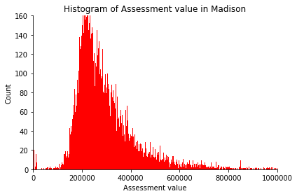

# General Exploration

## Average Sales Price and Other Variables
### Aarushi Gupta, 11/16

This plot shows the percentage distribution of different races in different areas. The y-axis represents the mean sales prices. We tried to see any visible trend, however it seems that there are not really any important trends. It is mostly that each area has a higher percentage of white population and lower percentage of other races. The only useful comparison is that the areas having very high mean sale prices have very low percentages of other races while a higher percentage of white population.

We also studied how does various other factors effect these mean sales prices

## Map of Recorded Single Family Parcels
### Aarushi Gupta, 11/02

This plot shows the number distribution of Black people across different postal codes in the city of Madison. On the map, each pink dot denotes a house that was assessed by the city. One major conclusion is : A few areas with densely black populations are unassessed by the city. This might indicate towards racial biases.  However, we lack some concrete evidence because it might be possible that these areas are not populated thickly by population or don't include many houses. This is something, we will try to work on in our final report.

## Distribution of Single Family sales prices over time.
### Ben Kizaric 10/19

As a pre-cursor to using sales prices in further analyses, we needed to examine how the sales prices of single family homes in Madison have changed over time, so we can adjust for inflation, and how the market value of homes has changed over time.

So, we construct two animations showing how the distribution of sales prices has changed over time. Each frame of the animation shows the distribution of sales prices in a 3 year span, to reduce the noise of small year-to-year variations in sales prices. 

The first animation does not adjust for inflation, and a very significant increase in raw sales prices can be observed from 1975 to 2020, with only two periods of decreased raw sales prices seen. One in the early-mid 1980s, and one in the aftermath of the 2008 financial crisis. The second animation *does* adjust for inflation, yet there is still growth in sales prices from 1975-2020, indicating that homes have become more expensive, even when considering that the value of the US dollar has dropped since 1975. The two periods of decreased sales prices are the same as in the previous graph.

An interesting trend in both of the animations is that from 1975-2000, the median sales price was roughly equal to the mode sales price, but from 2000-2020, the median sales price is usually a few thousand dollars ahead of the mode. 

## Distribution of Single Family Tax-Assessed Home Values
### Desmond Fung, 9/28

In this section, we decided to filter our data based on property use e.g. Condominium, Restaurant, apartment, single-family, and explore into **the total assessment value for single-family properties in Madison.** We can observe that the assessment value is centered at approximately $250000, which can serve as a reference point for us so that in the future we can look into the racial disparity around that specific value. To explore the histogram further, we made a Cumulative Distribution Function of assessment value. We can observe that the cumulative probability peaked very early on in the x-axis, which means the cumulative probability that a single family's assessment value is $500000 or less is approximately at 0.9, which lines up with our observation from the histogram that the assessment value center at approximately $250000.

