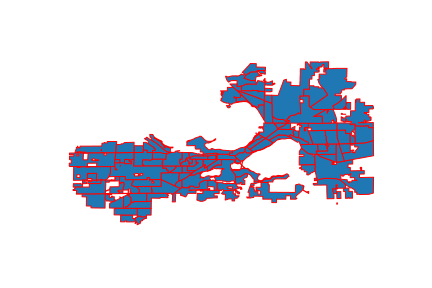

# Report

**Ben Kizaric**

**Aarushi Gupta**

**Desmond Fung**

## Introduction

What is an assessment, & Why should we care?

**Tax Assessment Value** is the value that a city assigns to a property, which determines how much property tax the owners of that property will pay. In Madison, Single family (homes), multi-family (apartments), and commercial properties / parcels are assessed separately. This report will focus on single-family properties. 

**Assessment Areas** are geographic portions of cities that are meant to group similar homes together. When individual homes are assessed by the city, they are compared against similar homes throughout a city, but mostly against those in the same assessment area. One would expect a home on a city's outskirts to be compared to other more rural homes, not one nestled in the city center. Assessment areas are important because they help determine how much property tax each home has to pay, a significant expense for homeowners, and because those property taxes are the largest source of revenue for cites. 

The homes in "good" assessment areas should be relatively similar in some respect, like having similar prices.

In this project, we have evaluated the quality of assessment areas 3 ways.

*  Standard Deviation of sales prices of homes within assessment areas. 
   * Motivation: in "good" assessment areas, homes are priced similarly. Assessment areas with a low standard deviation of sales prices will be priced similarly.
   * We also use the IQR of sales prices of homes within assessment areas as a measure of spread that is less susceptible to outliers.
*  Standard Deviation of growth rate of sales prices of homes within assessment areas.
   * Motivation: in "good" assessment areas, homes are affected by market prices in a similar way, and the values of homes should be growing / shrinking at a similar rate.  
*  Assessment Value Accuracy: The percentage of the most recent sales price that the assessed value for a home is above or below the sales price, which can be expressed as `100 * (AssmtPrice-SalesPrice)/SalesPrice`. The average or median of this value for each home in an assessment area is then taken.
   * For example, if a home recently sold for $100K, and it was assessed for \$200K, it's assessment value accuracy score would be 100%, because it is assessed at double it's most recent sales price.
   * Motivation: "Fair" assessment prices for homes should be roughly equal to the sales price of the home, so "fair" assessment areas will have assessment value accuracy scores around zero, or at least all be at the same level of over / under evaluation.

**A note on fairness:** The over/under assessment of a home has different implications for the homeowner and the city. For example, consider when a home was under-assessed (a negative assessment value accuracy score):

* This is *good for the homeowner* because they will be paying less taxes than they would if their home was assessed at the last sales price.  
* But, this is *bad for the city*, because the city will be getting less tax revenue.   

Generally, we consider any score closer to 0 "better", in a way looking at the absolute value of homes, so a home under / overvalued by 10% is equally "accurate". But when we discuss the fairness of assessment values, we are especially sensitive to some sections of the city having a higher/lower scores than others. For example, if we found that predominantly black assessment areas had a higher accuracy score than white neighborhoods, this would hint at a racial unfairness, as black households would be paying more in taxes relative to the sales price of their homes. 

## Methodology

### Data Sources

We used four publicly available datasets to make the conclusions in this report.

* [City of Madison open data portal: Tax Parcels](https://data-cityofmadison.opendata.arcgis.com/datasets/tax-parcels-assessor-property-information)
  * This dataset has information on every single-family property in Madison, including it's location, assessment area membership, and characteristics of the home, like square footage and number of bedrooms. 
* [City of Madison open data portal: Single Family Assessment Areas](https://data-cityofmadison.opendata.arcgis.com/datasets/assessment-areas-single-family)
  * This dataset has the boundaries of each single family assessment area in Madison.
* [City of Madison's Assessor's Office](https://www.cityofmadison.com/assessor/property/additionalpropertydata.cfm?ParcelN=070933204243&Type=S) 
  * The city of Madison publishes more in-depth information on each property in the city on the assessor's office website. This data source provided us the assessment prices and past sales prices on each single family property.
* 2010 Census Data
  * 2010 Census Data provided information on the demographics of different regions of Madison. Each single-family home is labeled with the census tract, so we were able to estimate the demographics of each single-family assessment area.  

#### Deficiencies in our data.

The primary deficiency of our data is that we could only gather assessment values for 2019 and 2020. Without assessment values for each year, it is hard to determine the fairness / accuracy of assessments relative to sales prices because the sales prices vary according to the housing market. 

### Adjustments

#### Time Adjusted Sales Price

In order to compare the fairness of assessment prices in relation to the sales prices of homes, there must be a consistent way to compare the sales prices of homes. However, there are two hurdles that make this difficult.

* **Inflation:** $100K in 1980 is much more than \$100K in 2020 dollars. 

* **The Housing Market:** Even after accounting for inflation, home sales prices are influenced by the overall trends of the housing market. For example, a home sold in 2007 would likely sell for far more than an identical home sold in 2009. This should be accounted for. The following animation demonstrates this change over time:

   

  

To account for these factors, we created a metric we call **Time Adjusted Sales Price**. To calculate this price for a sale in 1980, we first inflate the original price to be in terms of 2020 dollars. We then add the difference in median (inflated) sales prices between 1980 and 2020 to the price. For example, if the median price of a home sold in 1980 is $150K (after inflation), and the median price in 2020 is \$200K, we add \$50K to the inflated sales price from the home sold in 1980. This ensures that the median Time Adjusted Sales Price of homes sold in any year is the same as the median sales price. The following animation demonstrates this over time.

**Caveat:** This method makes sense to compare the prices of homes sold in 2007 vs 2009, but it may not make as much sense to perform this same adjustment on older sales prices. It is reasonable to assume that if a home was most recently sold in 1980, it is likely an older home than the average home sold most recently in 2018. As such, it may have lost more of it's market value and is not as comparable to homes sold more recently. It is also important to note that the median recent sales year of homes in Madison is 2013, so this caveat will have limited effect.

## Context on Madison's Assessment Areas:

There are about 100 single family tax assessments in the city of Madison. Pictured below are heatmaps depicting the racial composition of these assessment areas. It can be seen that while Madison is predominately white, there are regions of Madison with a significant minority population. 

Here is a heatmap depicting the average time-adjusted sales prices in homes in Madison. 

As one might expect, homes close to downtown, as well as those bordering Madison's lakes are priced relatively high.

## Question: Are assessments and assessment areas fair?

### Race

### Time of Sale

We also examined the relationship between assessment fairness / accuracy and the time a home was most recently sold. Pictured below is a scatterplot depicting this relationship. The two black lines show the median assessment accuracy from both 1970 to 2000 (21% undervalued) , and from 2000 to 2020 (13% undervalued). It can be seen that homes sold more recently are generally less under-valued. 

## Question: How can assessment areas be improved?

### Current Area Quality

Below is a heatmap depicting the IQR of normalized, time adjusted sales prices within Madison's single family assessment areas. 

With the exception of some low-population outliers on the outskirts of Madison, there is a reasonable amount of variation of sales prices in all of Madison's assessment areas. There is less variation in Madison's newer suburbs to the far east and west of the city. 

### Alternative Area Maps

This section examines three potential single families assessment area maps.

- The current assessment area map created by the city of Madison.
- A map created to made the standard deviation of sales prices similar between areas.
- A map created to make the standard deviation of growth rate of sales prices similar between areas.

The last two maps were created by repeatedly splitting a large assessment area (starting with the whole city as 1 assessment area), into two assessment areas, so that the standard deviation of sales price growth rates was a close as possible between the two new, smaller assessment areas. This splitting process is then repeated for each of these two new areas.

To ensure, "normal" looking assessment areas, we imposed a few extra criteria on each split:

- Both assessment areas have to have at least 25 homes in them.
- Both assessment areas have to exceed a minimum size.
- Both assessment areas can't be too wide / narrow, defined by the ratio of their widths and heights.
- The number of homes in the two assessment areas can't be different by more than a factor of 2.

The plots below show the distribution of standard deviations of sales price growth rates in both the new and the old assessment areas.

Even though the new assessment areas were optimized to have near-equal standard deviations of sales prices, the new assessments actually performed worse than the old ones. This might be because they only have straight, right-angle boundaries. It could also be that most of the variation of sales price growth is very localized, and sufficiently large assessment areas will have a hard time separating out the localized variation.

### Alternative Area Maps Price Simulation

Finally, we looked to see the impact that these two maps would have on assessment prices, and if the assessment prices simulated under these new maps are more accurate than for existing maps. In order to do this, we created three "simulated" assessment prices **for each house,** using three regression models, each corresponding to a different assessment area map. Each regression model was trained, using every home in Madison, to predict the total assessment value of a home. The three regression models all used the following variables about homes as inputs:

- The home's time-adjusted sales price
- The home's square footage
- The year the house was built
- The median sales price of home's in that home's assessment area.
  - This was different between the three assessment area maps.

This process yielded three simulated assessment prices for each house. I then looked at the degree of under/over-evaluation, defined by `100*(AssmtPrice-SalesPrice)/SalesPrice` for each of the simulated assessment prices for each house.

Pictured above is a bar plot depicting the average under-evaluation under the three different maps / three simulated assessment values. The different in evaluation is relatively small, but the price-optimized and growth-optimized maps result in more accurate simulated assessment prices.

## Conclusions

We have drawn 3 main conclusions from this analysis. 

#### Single-family assessments are fair, racially speaking.

We have seen no significant evidence that homes in predominately minority areas are assessed unfairly. 

#### Recently sold homes are less under-valued.

While there may be other factors at play, it is clear that homes sold within the past two decades have been assessed higher relative to their sales prices than older-sold homes. 

#### Single-family assessment areas are mostly fine as is.

There is variation within each assessment area, but no area stands out as having too much variation. Attempts to create new maps that minimize this variation do little to improve the variation within and between assessment areas, as well as assessment accuracy. 

