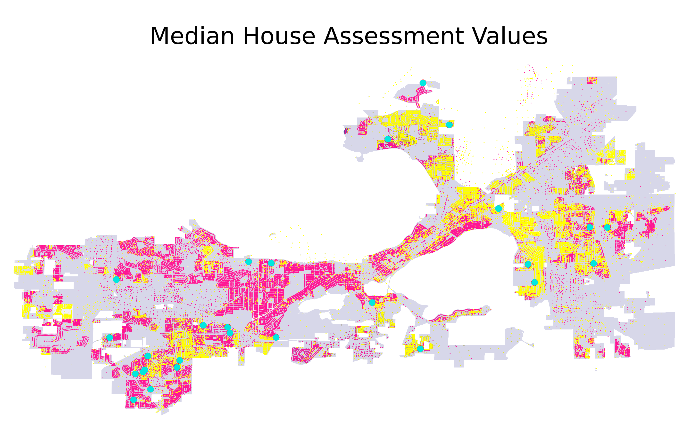

# Single Family Tax Assessments in Madison

**Authors:** Ben Kizaric (bakizaric@wisc.edu), Aarudwdeshi Guptta (gupta232@wisc.edu), Desmond Fung (dfund2@wisc.edu)

## Introduction

In Madison, property taxes are proportional to a property's value, which is estimated by city assessors.  Higher assessments correspond to greater yearly tax collection, so it is important that assessments be accurate, or at least consistent (e.g., if properties are under-assessed on average, the under-assessment should at least be uniform so that all property owners benefit evenly). This report will focus on single-family properties. 

Key to this report is the idea of assessment accuracy, and assessment fairness. We define **Assessment Accuracy** as the percentage of the most recent sales price that the assessed value for a home is above or below the sales price, which can be expressed as `100 * (AssmtPrice-SalesPrice)/SalesPrice`. For example, if a home recently sold for $100K, and it was assessed for \$200K, it's assessment value accuracy score would be 100%, because it is assessed at double it's most recent sales price. For this reason, we consider homes with positive accuracy scores to be over-assessed, and homes with negative accuracy scores to be under-assessed.

The over/under assessment of a home has different implications for the homeowner and the city. For example, consider when a home is under-assessed. This is *good for the homeowner* because they will be paying less taxes than they would if their home was assessed at the last sales price. But, this is *bad for the city*, because the city will be getting less tax revenue. Generally, we consider any score closer to 0 "better", in a way looking at the absolute value of homes, so a home under / overvalued by 10% is equally "accurate". But when we discuss the fairness of assessment values, we are especially sensitive to some sections of the city having a higher/lower scores than others. For example, if we found that predominantly black assessment areas had a higher accuracy score than white neighborhoods, this would hint at a racial unfairness, as black households would be paying more in taxes relative to the sales price of their homes. 

**Assessment Areas** are geographic portions of cities that are meant to group similar homes together. When individual homes are assessed by the city, they are compared against similar homes throughout a city, but mostly against those in the same assessment area. One would expect a home on a city's outskirts to be compared to other more rural homes, not one nestled in the city center. Assessment areas are important because they help determine how much property tax each home has to pay, a significant expense for homeowners, and because those property taxes are the largest source of revenue for cites. 

The homes in "good" assessment areas should be relatively similar in some respect, like having similar prices.

In this project, we have evaluated the quality of assessment areas 3 ways.

*  Standard Deviation of sales prices of homes within assessment areas. This is based on the idea that in "good" assessment areas, homes are priced similarly. Assessment areas with a low standard deviation of sales prices will be priced similarly. We also use the IQR of sales prices of homes within assessment areas as a measure of spread that is less susceptible to outliers.
*  Standard Deviation of growth rate of sales prices of homes within assessment areas. The motivation being that in "good" assessment areas, homes are affected by market prices in a similar way, and the values of homes should be growing / shrinking at a similar rate.

## Methodology & Data

### Data Sources

We used four publicly available datasets to make the conclusions in this report. From the City of Madison's open data portal, we use the [Tax Parcels](https://data-cityofmadison.opendata.arcgis.com/datasets/tax-parcels-assessor-property-information), which has information on every single-family property in Madison, including it's location, assessment area membership, and characteristics of the home, like square footage and number of bedrooms. Also from the city's portal, we use the [Single Family Assessment Areas](https://data-cityofmadison.opendata.arcgis.com/datasets/assessment-areas-single-family) dataset to get the boundaries of each single family assessment area in Madison. The city also publishes more in-depth information on each property in the city on the [assessor's office website.](https://www.cityofmadison.com/assessor/property/additionalpropertydata.cfm?ParcelN=070933204243&Type=S) This data source provided us the assessment prices and past sales prices on each single family property. Finally, 2010 Census Data provided information on the demographics of different regions of Madison. Each single-family home is labeled with the census tract, so we were able to estimate the demographics of each single-family assessment area.  

### Deficiencies in our data.

The primary deficiency of our data is that we could only gather assessment values for 2019 and 2020. Without assessment values for each year, it is hard to determine the fairness / accuracy of assessments relative to sales prices because the sales prices vary according to the housing market.

We also wanted to assess if all the houses in the City of Madison are assessed equally. Our aim was to find any racial biases in the division of assessment areas and the way homes are assessed. We are going to pay special attention to these areas in our analysis below.

We were also interested in the extend of missing home data. The heat map below shows the population of each Assessment Area of the City of Madison. Each orange dot corresponds to a single-family home of that area. One of the key problems we faced during our analysis was the unavailability of data for a few areas. You can see that the East Sector is one of the densely populated areas yet is one of the least assessed areas. However, we believe that this discrepancy between population and number of homes has more to do with the prevalence of apartments in these areas. 

### Adjustments

#### Time Adjusted Sales Price

In order to compare the fairness of assessment prices in relation to the sales prices of homes, there must be a consistent way to compare the sales prices of homes. However, there are two hurdles that make this difficult.

* **Inflation:** $100K in 1980 is much more than \$100K in 2020 dollars. 

* **The Housing Market:** Even after accounting for inflation, home sales prices are influenced by the overall trends of the housing market. For example, a home sold in 2007 would likely sell for far more than an identical home sold in 2009. This should be accounted for. The following animation demonstrates this change over time:

   

  

To account for these factors, we created a metric we call **Time Adjusted Sales Price**. To calculate this price for a sale in 1980, we first inflate the original price to be in terms of 2020 dollars. We then add the difference in median (inflated) sales prices between 1980 and 2020 to the price. For example, if the median price of a home sold in 1980 is $150K (after inflation), and the median price in 2020 is \$200K, we add \$50K to the inflated sales price from the home sold in 1980. This ensures that the median Time Adjusted Sales Price of homes sold in any year is the same as the median sales price. The following animation demonstrates this over time.

**Caveat:** This method makes sense to compare the prices of homes sold in 2007 vs 2009, but it may not make as much sense to perform this same adjustment on older sales prices. It is reasonable to assume that if a home was most recently sold in 1980, it is likely an older home than the average home sold most recently in 2018. As such, it may have lost more of it's market value and is not as comparable to homes sold more recently. It is also important to note that the median recent sales year of homes in Madison is 2013, so this caveat will have limited effect.

## Context on Madison's Assessment Areas:

### Race:
As of July 1, 2019 the population of the City of Madison was 259,680 with 78.6% of the residents being Whites, 6.8% being Blacks, 9% Asians and 6.9% Hispanic.

In Madison there are 47,325 single family homes. These homes are split into 123 single family tax assessment areas with an average of 385 homes in each. Pictured below are heatmaps depicting the racial composition of these assessment areas. It can be seen that while Madison is predominately white, there are regions of Madison with a significant minority population. 

White Population :
* The highest percentage of white population is located at two primary locations : Near East Sector and Near West Sector.
* In addition to this, the majority of population is concentrated in the West Sector, Near West Sector, Isthmus and Near East Sector.

Black Population :
* As we move away from the center, the majority of Black population is located in the South Central Sector, North Sector and northern regions of the Near East Sector.

Asian Population :
* The highest percentage of Asian population is concentrated in one of the Assessment areas in the West Sector.

Hispanic Population 
* The South Central Sector has the majority of Hispanic population.

### Assessment Values & Sales Prices
Here is a heatmap depicting the average time-adjusted sales prices in homes in Madison. 

As one might expect, homes close to downtown, as well as those bordering Madison's lakes are priced relatively high.

The following maps shows where homes are assessed above the median value, below the median value, as well as at the median value.

* It seems like on the western side of Madison the houses are assessed above the median house assessment price, while on the east side the assessments are below the median assessment value. 
* We can see that houses above median value are primarily in the areas away from the downtown. The houses located in the downtown region are priced above the median.
* Another key takeaway is the lack of available data for the South Central Sector.
* In addition to this, the pink dots dominate the area where the majority of Asian population lives in the West Sector.

## Question: Are assessments and assessment areas fair?

### Race

A new analysis reported by The Washington post suggests that Black families pay significantly higher property taxes than white families across the U.S.. We are intrigued whether a similar trend is seen in Madison and whether a tax assessment by the city of Madison is accurate. 

Of particular interest is assessing the fairness of black neighborhoods, so we first looked at where houses are over-assessed (an assessment greater than sales price) and under-assessed (an assessment less than sales price), overlayed on where black residents live in Madison. 

We also look at the relationship between racial makeup and assessment fairness more closely.  In the following plots, we will be measuring the accuracy of tax assessment using `100 * (AssmtPrice-SalesPrice)/SalesPrice`. The black lines represent city-wide distribution while the other set of three lines represents per-area distribution. 

For accuracy, the average percentage error is -6.4\%, which means assessments are on average under-valuing home 6.4\% over its actual value.
 
For consistency, the standard deviation is 45, which means the accuracy percentages error is fairly spread out from their mean average value. Since standard deviation is not intuitive for many people without a statistical background, an interquartile range is provided for interpretability. The interquartile range is 14.4 percent, that's the same as 50\% of the data lies within -21 to -6.6 percent error.
 
For racial equality, the slope of the regression line for the Black resident is -1.1. This means there is a trend that tax assessment accuracy would decrease by -1.1\% for every increase in the percentage of black in the assessment area. In contrast, the slope of the regression line for White and Asian residents is 0.34 and respectively 0.28, which imply racial equality might exist in assessment values.
 
To answer our initial question, a negative regression line in black population means assessment value is less than sales price, which is good for individual residents since they pay less tax. The nationwide assessment trend reported by previous work does not appear in our analysis of house assessments in Madison in 2019.

### Time of Sale

We also examined the relationship between assessment fairness / accuracy and the time a home was most recently sold. Pictured below is a scatterplot depicting this relationship. The two black lines show the median assessment accuracy from both 1970 to 2000 (21% undervalued) , and from 2000 to 2020 (13% undervalued). It can be seen that homes sold more recently are generally less under-valued. 

## Question: How can assessment areas be improved?

### Current Area Quality

Below is a heatmap depicting the IQR of normalized, time adjusted sales prices within Madison's single family assessment areas. 

With the exception of some low-population outliers on the outskirts of Madison, there is a reasonable amount of variation of sales prices in all of Madison's assessment areas. There is less variation in Madison's newer suburbs to the far east and west of the city. 

### Alternative Area Maps

This section examines two potential single families assessment area maps. We look at both the current assessment area map created by the city of Madison, as well as a map created to made the IQR of sales prices similar between areas.

This last map was created by repeatedly splitting a large assessment area (starting with the whole city as 1 assessment area), into two assessment areas, so that the IQR of sales price growth rates was a close as possible between the two new, smaller assessment areas. This splitting process is then repeated for each of these two new areas.

To ensure, "normal" looking assessment areas, we imposed a few extra criteria on each split. (1) Both assessment areas have to have at least 25 homes in them. (2) Both assessment areas have to exceed a minimum size. (3) Both assessment areas can't be too wide / narrow, defined by the ratio of their widths and heights. (4) The number of homes in the two assessment areas can't be different by more than a factor of 2.

The plot below shows the distribution of IQR of sales price growth rates in both the new and the old assessment areas.

Even though the new assessment areas were optimized to have near-equal IQR of sales prices, the new assessments actually performed worse than the old ones. This might be because they only have straight, right-angle boundaries. It could also be that most of the variation of sales price growth is very localized, and sufficiently large assessment areas will have a hard time separating out the localized variation.

### Alternative Area Maps Price Simulation

Finally, we looked to see the impact that these two maps would have on assessment prices, and if the assessment prices simulated under these new maps are more accurate than for existing maps. In order to do this, we created three "simulated" assessment prices **for each house,** using three regression models, each corresponding to a different assessment area map. Each regression model was trained, using every home in Madison, to predict the total assessment value of a home. The three regression models all used the following variables about homes as inputs:

- The home's time-adjusted sales price
- The home's square footage
- The year the house was built
- The median sales price of home's in that home's assessment area.
  - This was different between the three assessment area maps.

This process yielded three simulated assessment prices for each house. We then looked at the degree of under/over-evaluation, defined by `100*(AssmtPrice-SalesPrice)/SalesPrice` for each of the simulated assessment prices for each house.

Pictured above is a bar plot depicting the average under-evaluation under the three different maps / three simulated assessment values. The different in evaluation is relatively small, but the price-optimized and growth-optimized maps result in more accurate simulated assessment prices.

## Conclusions

We have drawn 3 main conclusions from this analysis. 

#### Single-family assessments are fair, racially speaking.

We have seen no significant evidence that homes in predominately minority areas are assessed unfairly. 

#### Recently sold homes are less under-valued.

While there may be other factors at play, it is clear that homes sold within the past two decades have been assessed higher relative to their sales prices than older-sold homes. 

#### Single-family assessment areas are mostly fine as is.

There is variation within each assessment area, but no area stands out as having too much variation. Attempts to create new maps that minimize this variation do little to improve the variation within and between assessment areas, as well as assessment accuracy. 

