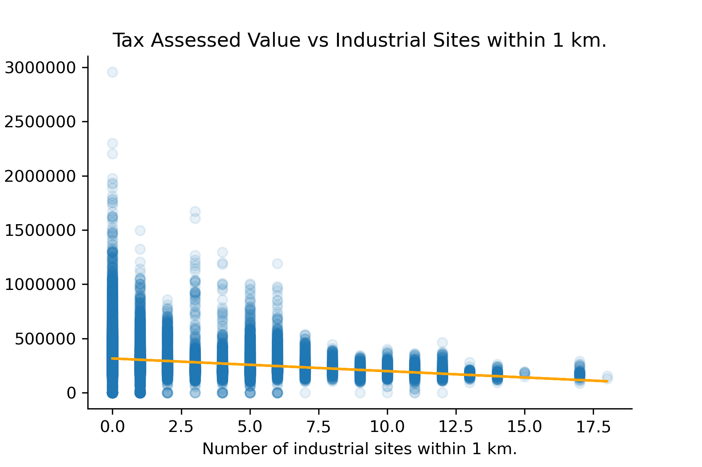
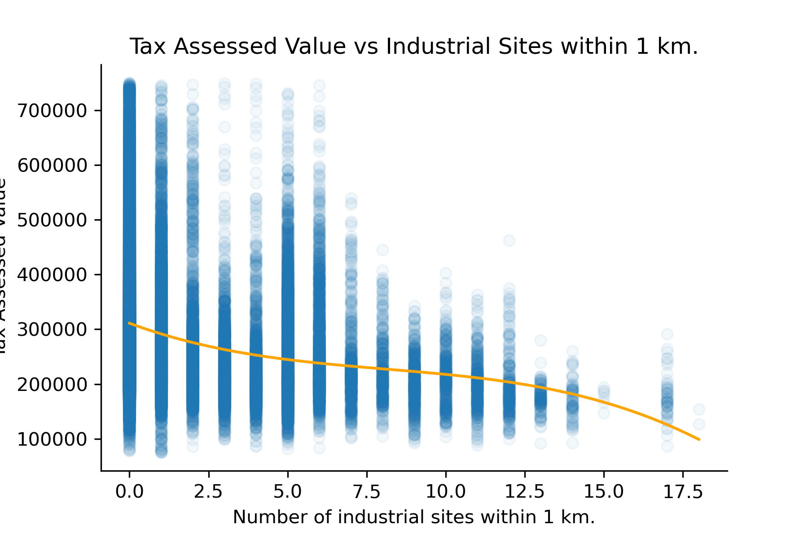
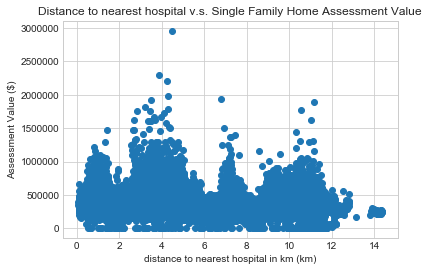

# Other Factors

## Relationship between number of nearby industrial sites and Tax Assesed Value
### Ben Kizaric, 10/5

This week, we have decided to explore the realationship between proximity to industrial sites (operationalized as number of industrial sites within a 1km radius) and the tax assessed values of simgle-family homes in madison. The first scatterplot shows all homes in Madison, and the second shows all homes valued between $75,000 and $750,000 USD. Although there is clearly a lot of noise in the data, there appears to be a negattive correlation between proximity to indistrial sites and home valuations, especialy with the highest valued homes.

## Relationship between proximity to hospitals and Tax Assesed Value

### Desmond Fung, 10/5

In this section, we explore whether being close to a hospital has an impact on single-family home assessment value. The above scatterplot shows 47604 single home families' assessment value(USD) plotted against their distance(km) to the single nearest hospital. No significant pattern was observed from the scatterplot, being close to a hospital doesn't necessarily reflect a higher assessment value. Therefore, we conclude that distance to the single nearest hospital has no relationship with single-family home assessment value
