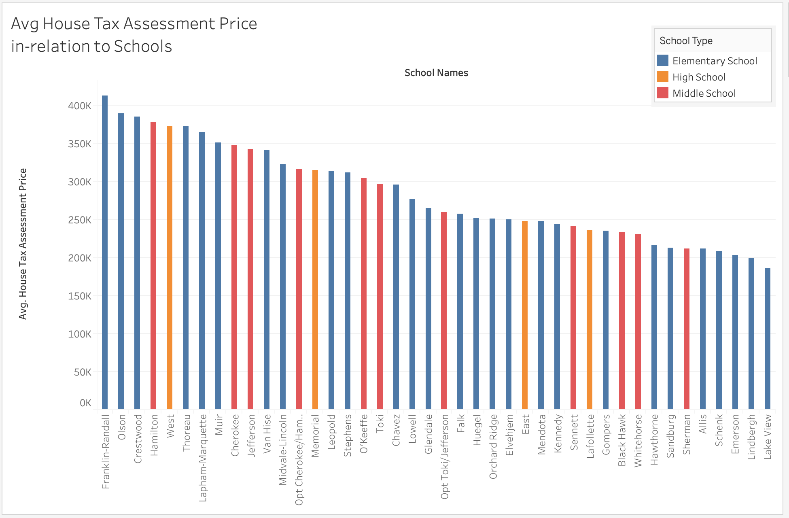
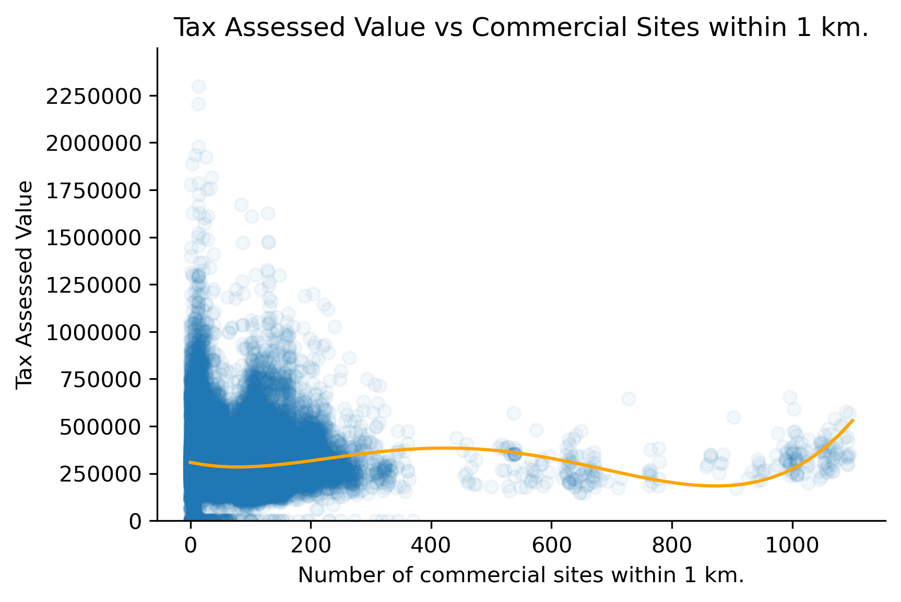
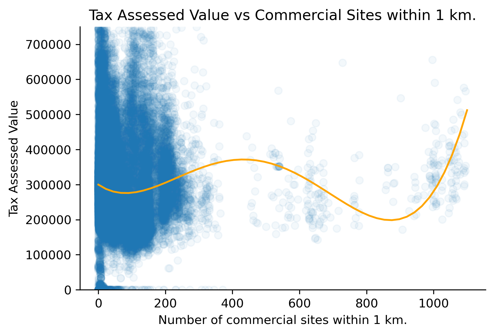
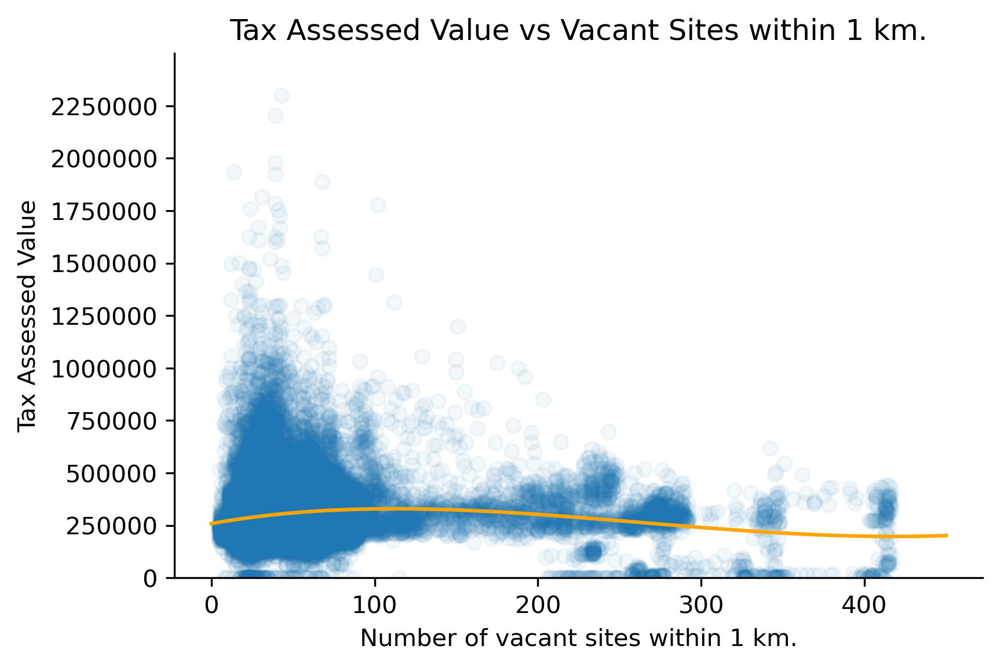
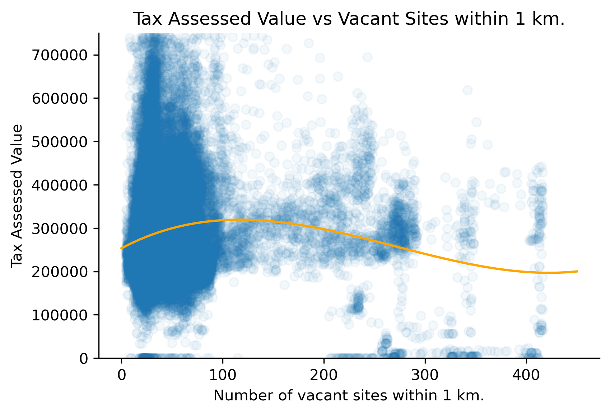

# Other Factors

## Schools and Home Properties

## Relationship between number of nearby commercial sites and Tax Assesed Value
### Ben Kizaric, 10/12

Building off of the work last week, we present plots showing the relationship between number of nearby commercial sites and tax assessed home value, with the first plot showing al homes, and the second one showing only houses assessed less than $750,000 USD. The Orange regression line is a polynomial regression line of degree 4, obtained using `numpy.polyfit`. Some takeaways:

*  The most expensive homes no not appear to be my many commercial sites. This might be because these homes are expensive "Mansions" that are secluded from more developed areas like downtown.
* There is an uptick of home value at the very end of the data. These might be expensive homes near downtown.

**STOP**

## Relationship between number of nearby vacant and Tax Assesed Value
### Ben Kizaric, 10/12

Building off of the work last week, we present plots showing the relationship between number of nearby vacant sites and tax assessed home value, with the first plot showing al homes, and the second one showing only houses assessed less than $750,000 USD. The Orange regression line is a polynomial regression line of degree 4, obtained using `numpy.polyfit`. Some takeaways:

* Excluding the homes / properties tax-assessed value of zero, there would be a positive relationship between number of nearby vacant sites and home values.
* Of the homes with a tax-assessed value of zero, many are near a lot of vacant sites. 
* The scatterplot appears to show a few clusters of homes that are near many sites.

One important thing to note is that there are different kinds of "vacant" parcels, and I do not take this into account. It is possible that many of these vacant lots are undeveloped land, not abandoned residential properties, which might explain some of the trends seen.

**STOP**

## Relationship between number of nearby industrial sites and Tax Assesed Value
### Ben Kizaric, 10/5

This week, we have decided to explore the relationship between proximity to industrial sites (operationalized as number of industrial sites within a 1km radius) and the tax assessed values of simple-family homes in Madison. The first scatterplot shows all homes in Madison, and the second shows all homes valued between $75,000 and $750,000 USD. Although there is clearly a lot of noise in the data, there appears to be a negative correlation between proximity to industrial sites and home valuations, especially with the highest valued homes.

## Relationship between proximity to hospitals and Tax Assesed Value

### Desmond Fung, 10/5

In this section, we explore whether being close to a hospital has an impact on single-family home assessment value. The above scatterplot shows 47604 single home families' assessment value(USD) plotted against their distance(km) to the single nearest hospital. No significant pattern was observed from the scatterplot, being close to a hospital doesn't necessarily reflect a higher assessment value. Therefore, we conclude that distance to the single nearest hospital has no relationship with single-family home assessment value
