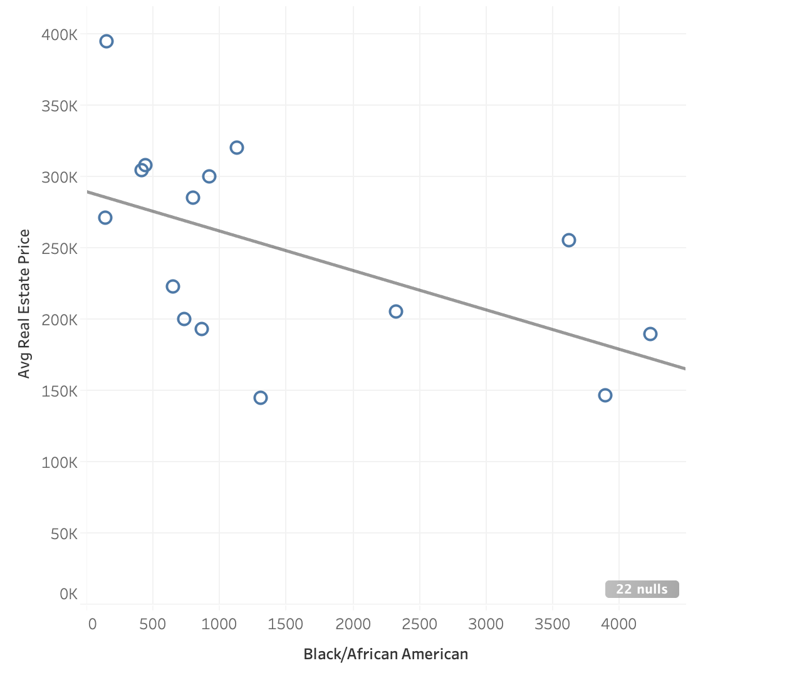

## Race

## Race and Accuracy of Tax-Assesed Value
### Desmond Fung, 11/09

We decided to filter all the Assessment Value that is less than $40000 because some assessment value are extremely small and therefore we are getting some extreme accuracy score.

Accuracy can be measured as $$\frac{AssessmentValue - SalesPrice}{AssessmentValue}$$
-  Positive → Assessments are over-valuing homes (Bad for people)
-  Negative → Assessments are under-valuing homes (Good for people)

The mean assessment accuracy is -0.16, so assessments are on average under-valuing home. No obvious trend was observed in the scatterplot. As the number of percentage of black resident increase in the area, the accuracy still remain the same where it goes from -1 to 1.

We tried approaching this question with a different equation. $$log\frac{SalesPrice}{AssessmentValue}$$
- 0 → Equal
- Positive → sales > assessment (Good)
- Negative → sales < assessment (Bad)

This model is a lot more evenly spread out than the last model. Mean assessment accuracy is 0.16, the exact opposite of last time. However, it still lead to the same conclusion that the number of percentage of black resident in the area has no effect on assessment accuracy.

## Race and Standard Deviation of Tax-Assesed Value
### Aarushi Gupta, 11/09

This week I didn’t spend much time on new plots. This one scatterplot shows the Percentage of Black People in each Assessment Area on the x-axis and the Standard Deviation in house Assessment Price for each area on y-axis. While there are a few outliers, it is clearly visible that places where black population is high, the std deviation is in the range of 0-100 and places where it is low, the std deviation is in the range of 0-200. There are a few outliers.
After the presentation in class, we are trying to come up with a better measure to plot on y-axis.

## Percentage of multiple races' residents in Madison Assessment Areas
### Desmond Fung, 11/02

We also constructed percentage of other races' residents in Madison Assessment Areas. We can see that Madison is mainly composed of white population. Only a handful of the area has less than 50% white percentage. On the other hand, Asians and Hispanic share the same scale (0 to 25) in contrast to (0 to 90) what we have seen earlier. When we take a closer look at the Asian population, we can observe they center around the Hilldale shopping center area, which is interestingly where I currently live. The Hispanic population is also fairly spread out in Madison. We can see a significantly higher than average percentage to the south of Lake Wingra.

## Race Composition of Assessment Areas, and Home Values
### Aarushi Gupta, 11/02

This pilot shows the percentage of Black population in each Assessment Area. The yellow dots on the map correspond to the houses that were assessed below the median house assessment value, and pink dots indicate the houses that were assessed above the median assessment value. The red big dots are the houses that had the median assessment price. The goal of making this plot was to study how houses are assessed in different areas depending on the percentage of black population. A few improvements we are planning to make for this plot is to find a better measure to compare the house assessment values and include other races to see if we get similar results.

## Average Inflation-Adjusted values for homes with racialized and non-racialized names in Madison.
### Desmond Fung, 10/19

--

Unlike the last plot where we look at the impact of racialized black name on Tax Assessment value in Madison. This week we want to investigate whether sellers having a racialized black name has an impact on Adjusted Sale Price for single-family home in Madison.

We explored 46498 addresses in Madison and filtered out all the sellers' names that contained any of the 80 racialized black names. Afterward, we split them into two groups, group that contains racialized name and group that doesn't contain racialized names.

The bar plot compares Adjusted Sale Price in thousand between racialized and non-racialized group.

Unlike what we have seen last week, having a racialized name in fact has a slight disadvantage than sellers who have a racialized name. (racialized mean $295200 vs. not racialized mean $282457). Even though it is not that big of a gap, around 4.4% more, it is still important to observe and recognize such a pattern exists between the two groups.

**END**

## Average Tax-Assessed values for homes with racialized and non-racialized names.
### Desmond Fung, 10/12

--

This week we want to investigate whether having a racialized black name has an impact on Tax Assessment Value in Madison.

We explored 75581 addresses in madison and filtered out all the buyers' names that contained any of the 80 racialized black names. Afterward, we split them into two groups, group that contains racialized name and group that doesn't contain racialized names.

The barplot compares total tax assessment value in thousand between racialized and non-racialized group.

Surprisingly, no significant difference was observed from the barplot(racialized mean $297556 v.s. not racialized mean $298463). It seems like having a racialized name doesn't cause any significant difference on the buyers' side.

Therefore, we conclude that racialized black name is not a factor in buyers' single-family tax assessment value.

**END**

## Relationship between number of Black Residents and average home sales price.
### Aarushi Gupta, 9/28

The x-axis represents the number of Africa-American/Black people present in different localities in Madison (Grouped by Zip Codes). The y-axis represents the Average Real Estate Sale Price in different localities. We tried to plot  the sale price with respect to number of black people living in that area. We can see a linear trend that as the number of black people in a locality increases the avg sale price goes down. However, this relation is not very strong.

In future, we plan to assess what other factors contribute to deciding the sale price of real-estate in a particular area.
