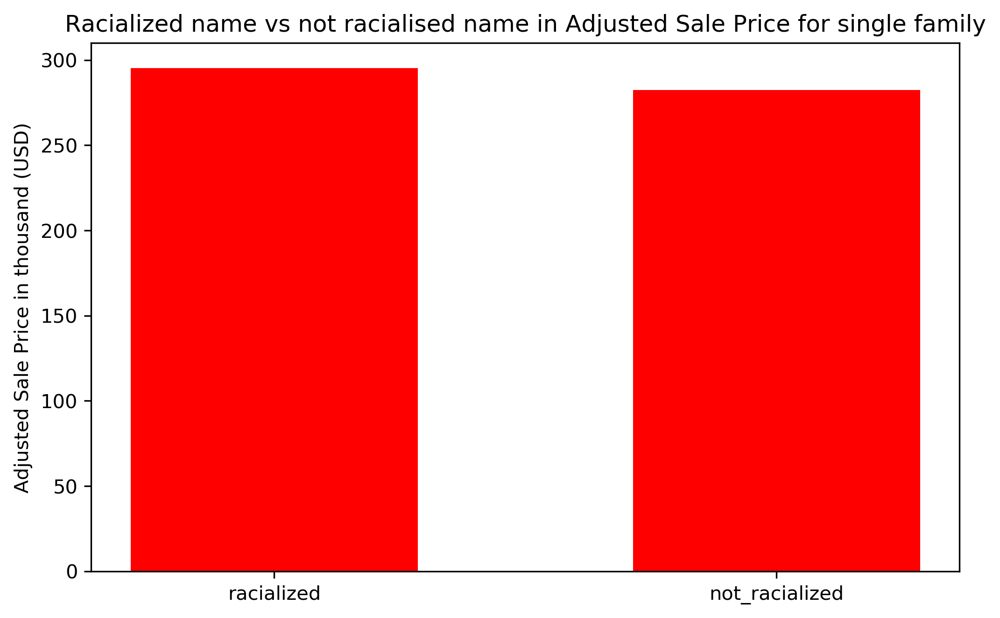

# Race

## Average Inflation-Adjusted values for homes with racialized and non-racialized names in Madison.

Unlike the last plot where we look at the impact of racialized black name on Tax Assessment value in Madison. This week we want to investigate whether sellers having a racialized black name has an impact on Adjusted Sale Price for single-family home in Madison.

We explored 46498 addresses in Madison and filtered out all the sellers' names that contained any of the 80 racialized black names. Afterward, we split them into two groups, group that contains racialized name and group that doesn't contain racialized names.

The bar plot compares Adjusted Sale Price in thousand between racialized and non-racialized group.

Unlike what we have seen last week, having a racialized name in fact has a slight disadvantage than sellers who have a racialized name. (racialized mean $295200 vs. not racialized mean $282457). Even though it is not that big of a gap, around 4.4% more, it is still important to observe and recognize such a pattern exists between the two groups.

## Average Tax-Assessed values for homes with racialized and non-racialized names.
### Desmond Fung, 10/12

This week we want to investigate whether having a racialized black name has an impact on Tax Assessment Value in Madison.
We explored 75581 addresses in madison and filtered out all the buyers' names that contained any of the 80 racialized black names. Afterward, we split them into two groups, group that contains racialized name and group that doesn't contain racialized names.
The barplot compares total tax assessment value in thousand between racialized and non-racialized group.
Surprisingly, no significant difference was observed from the barplot(racialized mean \\$297556 v.s. not racialized mean \\$298463). It seems like having a racialized name doesn't cause any significant difference on the buyers' side.
Therefore, we conclude that racialized black name is not a factor in buyers' single-family tax assessment value.

**END**

## Relationship between number of Black Residents and average home sales price.
### Aarushi Gupta, 9/28

The x-axis represents the number of Africa-American/Black people present in different localities in Madison (Grouped by Zip Codes). The y-axis represents the Average Real Estate Sale Price in different localities. We tried to plot  the sale price with respect to number of black people living in that area. We can see a linear trend that as the number of black people in a locality increases the avg sale price goes down. However, this relation is not very strong.

In future, we plan to assess what other factors contribute to deciding the sale price of real-estate in a particular area.