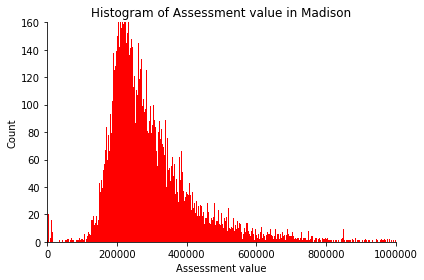
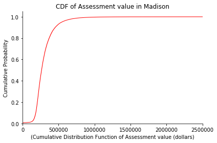
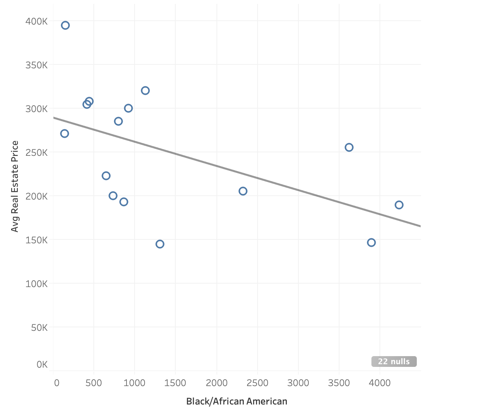

# Week 5: September 28th

## Distribution of Single Family Tax-Assessed Home Values

In this section, we decided to filter our data based on property use e.g. Condominium, Restaurant, apartment, single-family, and explore into **the total assessment value for single-family properties in Madison.** We can observe that the assessment value is centered at approximately $250000, which can serve as a reference point for us so that in the future we can look into the racial disparity around that specific value. To explore the histogram further, we made a Cumulative Distribution Function of assessment value. We can observe that the cumulative probability peaked very early on in the x-axis, which means the cumulative probability that a single family's assessment value is $500000 or less is approximately at 0.9, which lines up with our observation from the histogram that the assessment value center at approximately $250000.

## Relationship between number of Black Residents and average home sales price.

The x-axis represents the number of Africa-American/Black people present in different localities in Madison (Grouped by Zip Codes). The y-axis represents the Average Real Estate Sale Price in different localities. We tried to plot  the sale price with respect to number of black people living in that area. We can see a linear trend that as the number of black people in a locality increases the avg sale price goes down. However, this relation is not very strong.

In future, we plan to assess what other factors contribute to deciding the sale price of real-estate in a particular area.